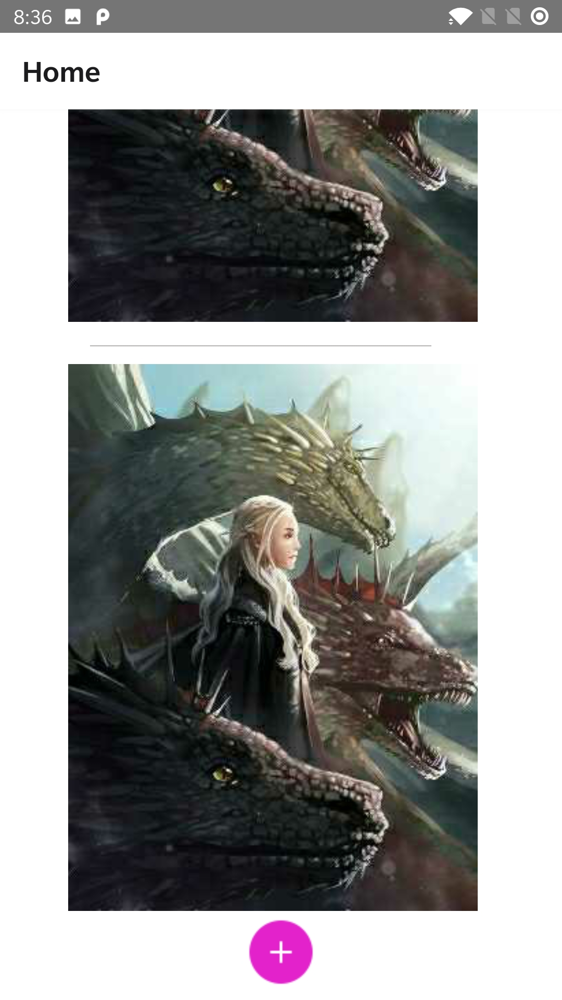

# ImageStorage-frontend

<p align="center"></p>

A frontend repository for Image Storage. A simple Image storing application developed using React-Native and GraphQL with MongoDB and Cloudinary to store data

Tech stack used – React-Native, React-Native Cli and GraphQL.

This is the backend repository for ImageStorage. If you are looking for the backend repository, [click here](https://github.com/ShanmukhSreenivas/ImageStorage-backend).

Developed as a part of as an assignment for Cilire Digital Intern recuirt process.

###### Note

Following versions were used in the development of this project:

* Node.js 14.16.1.
* Node Package Manager (npm) 7.12.1.
* Editor used was Visual Studio Code 1.57.1.

## Table of contents
* [Instructions to setup locally](#instructions-to-setup-locally)
  * [Installing modules](#installing-modules)
  * [Running the app](#running-the-app)
* [Screen Shots of the Application](#screen-Shots)
* [Contributing](#contributing)

## Instructions to setup locally

### Installing modules

* Run the following commands in the terminal/console window in the project directory:

```bash
$ cd ImageStorage-frontend

$ npm install
```

### Running the app

* Run the following commands in the terminal/console window to run ImageStorage Backend:

* Android

```bash
$ cd ImageStorage-frontend

$ npx react-native run-android

```
* IOS

```bash
$ cd ImageStorage-frontend

$ npx reacct-native run-ios
```

## ScreenShots of the Application

<p align="center"><a></a><a>  </a><a></a><a></a><a></a></p>
<p align="center"><a></a><a></a><a></a><a></a></p>

## Contributing

* Fork this project by clicking the ```Fork``` button on top right corner of this page.
* Open terminal/console window.
* Clone the repository by running following command in git:

```bash
$ git clone https://github.com/[YOUR-USERNAME]/ImageStorage-backend.git
```

* Add all changes by running this command.

```bash
$ git add .
```

* Or to add specific files only, run this command.

```bash
$ git add path/to/your/file
```

* Commit changes by running these commands.

```bash
$ git commit -m "DESCRIBE YOUR CHANGES HERE"

$ git push origin
```

* Create a Pull Request by clicking the ```New pull request``` button on your repository page.
